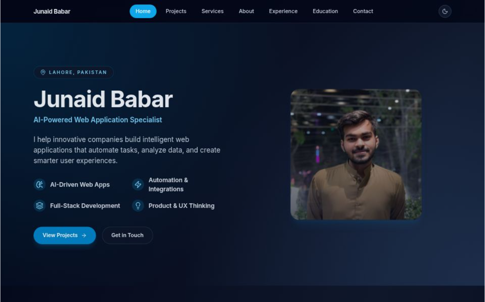

Here’s your **final polished `README.md`** — clean, professional, and written exactly in your tone. It’s structured for open-source readability, GitHub SEO, and professional employer impressions.
Just copy–paste this directly into your repo’s root.

---

```markdown
# 🧠 Junaid Babar — Personal Portfolio & Brand Platform



<!--
  TODO: CREATE YOUR SHOWCASE IMAGE
  1. Open your deployed portfolio website (custom domain or Vercel link).
  2. Capture a full-width screenshot of the home page.
  3. Save it as `portfolio-showcase.png` inside `/public/` and commit it.
-->

<div align="center">

[](https://your-domain.com)

<!-- TODO: Replace above URL with your actual live domain -->

[](https://opensource.org/licenses/MIT)

</div>

---

## 🚀 About This Project

This repository contains the complete source code for my **personal developer portfolio** — a high-performance, minimal, and intelligent showcase platform built with **Next.js 14**, **TypeScript**, and **Tailwind CSS**.

It’s not just another static site. This portfolio is **data-driven** — everything from projects and experience to services and blogs is modularized under `/src/data`, making updates effortless and scalable.

The idea is to make a **personal brand system**, not just a website — clean, modular, and future-proof.

---

## ✨ Key Features

- **⚡ Data-Driven Architecture:** Content for About, Projects, Experience, and Services lives in `/src/data` for easy updates.
- **🌓 Light & Dark Mode:** Seamless theme toggling via `next-themes`.
- **🎞️ Smooth Animations:** Elegant transitions and scroll effects with Framer Motion.
- **🧱 Modular Design System:** Built around reusable UI components with clean folder structure.
- **📬 Smart Contact Form:** Integrated with [Resend](https://resend.com/) API for secure email delivery.
- **💡 Dynamic Routing:** `/projects/[slug]`, `/services/[slug]`, and `/blog/[id]` generated from centralized data files.
- **⚙️ Optimized Build:** Server-side rendering, static generation, and automatic image optimization via Next.js.

---

## 🛠️ Tech Stack

| Category       | Technology                                      |
| -------------- | ----------------------------------------------- |
| **Framework**  | [Next.js 14 (App Router)](https://nextjs.org/)  |
| **Language**   | [TypeScript](https://www.typescriptlang.org/)   |
| **Styling**    | [Tailwind CSS](https://tailwindcss.com/)        |
| **Animations** | [Framer Motion](https://www.framer.com/motion/) |
| **Icons**      | [Lucide React](https://lucide.dev/)             |
| **Email API**  | [Resend](https://resend.com/)                   |
| **Deployment** | [Vercel](https://vercel.com/)                   |

---

## 📁 Project Structure

Here’s the logical breakdown of how everything’s organized:
```

📦 portfolio/
├── public/ # Static assets (images, favicon, resume.pdf)
├── src/
│ ├── app/ # Next.js App Router pages (Home, About, etc.)
│ │ ├── api/ # API routes (contact form, etc.)
│ │ ├── projects/ # /projects and /projects/[slug]
│ │ ├── services/ # /services and /services/[slug]
│ │ ├── blog/ # /blog and /blog/[id]
│ │ └── layout.tsx # Global layout
│ ├── components/ # Reusable UI components
│ └── data/ # Centralized data sources
│ ├── about.ts
│ ├── experience.ts
│ ├── projects.ts
│ ├── services.ts
│ └── blogs.ts
├── .env.local # API keys (ignored by Git)
├── .env.example # Environment variable template
├── package.json
└── README.md

````

---

## ⚙️ Local Setup

### 1. Clone the Repo
```bash
git clone https://github.com/Mian-JunaidBabar/portfolio-junaidbabar.git
cd portfolio-junaidbabar
````

> 📝 _If you named your repo differently, update the folder name above._

### 2. Install Dependencies

```bash
npm install
```

### 3. Configure Environment Variables

Create a `.env.local` file in the root and add:

```bash
# Get your free API key from https://resend.com
RESEND_API_KEY=re_YourSecretApiKeyHere
```

### 4. Run the Development Server

```bash
npm run dev
```

Then open [http://localhost:3000](http://localhost:3000) to see it live.

---

## 🌐 Deployment

Deployment is instant via **Vercel**.

### Steps:

1. Fork this repository.
2. Go to [vercel.com](https://vercel.com/) → import the repo.
3. Add your `RESEND_API_KEY` under _Environment Variables_ in Vercel project settings.
4. Deploy — Vercel will handle the build automatically.

Every push to your `main` branch redeploys the site automatically.

---

## 🧩 Future Enhancements

- Add `/blog` support with Markdown rendering.
- Integrate analytics (PostHog or Plausible).
- Add Open Graph and SEO meta tags from `/data`.
- Add dark/light preview screenshots in README.

---

## 🪪 License

This project is licensed under the **MIT License**.
See the [LICENSE](./LICENSE) file for full details.

---

## 🤝 Connect With Me

- **Portfolio:** [junaidbabar.vercel.app](https://junaidbabar.vercel.app)
- **GitHub:** [@Mian-JunaidBabar](https://github.com/Mian-JunaidBabar)
- **LinkedIn:** [Junaid Babar](https://linkedin.com/in/mian-junaidbabar)
- **Email:** [junaidbabar121@gmail.com](mailto:junaidbabar121@gmail.com)

---

<div align="center">
Built with ❤️ by <strong>Junaid Babar</strong> — blending code, design, and intelligence.
</div>
```
